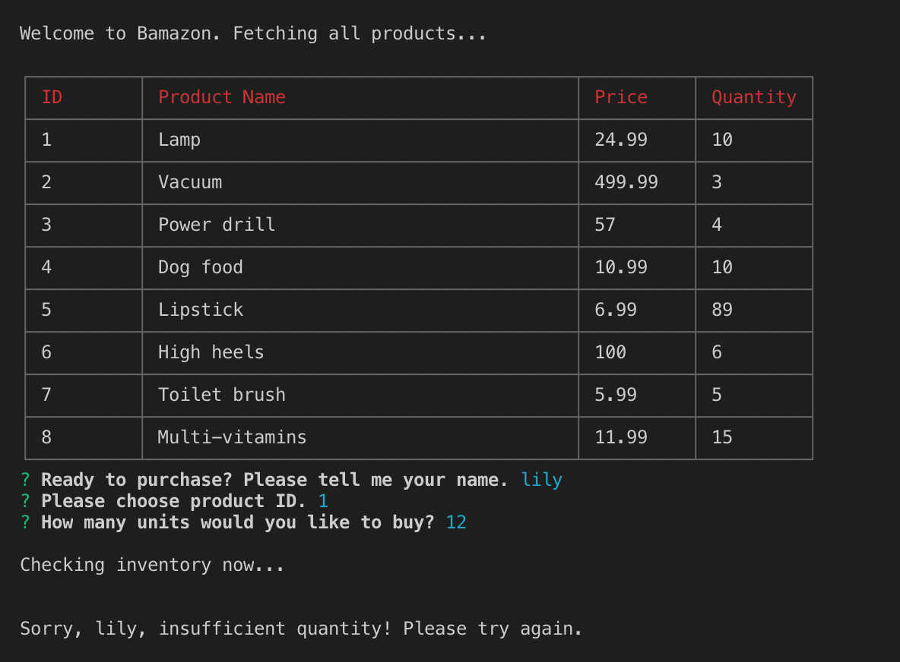
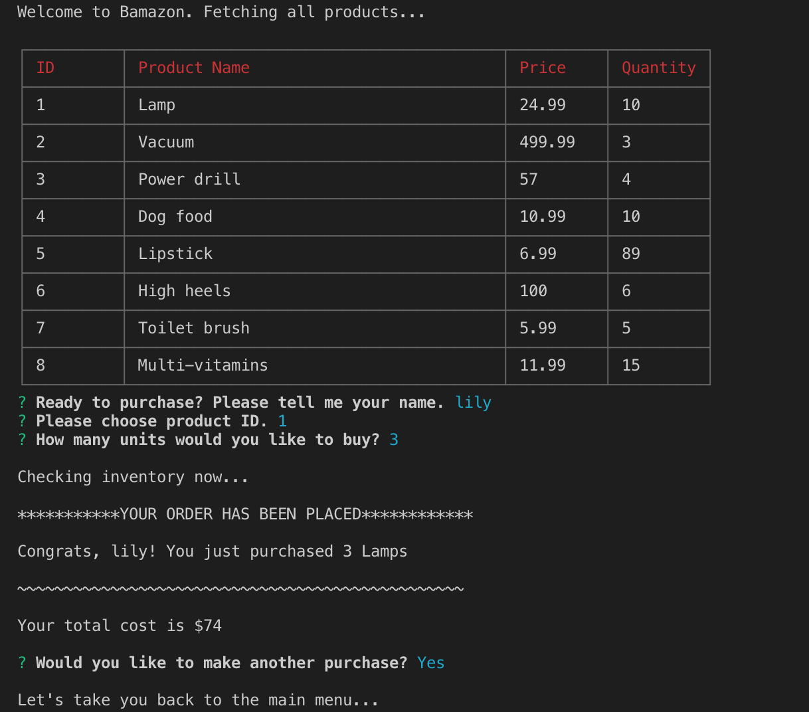
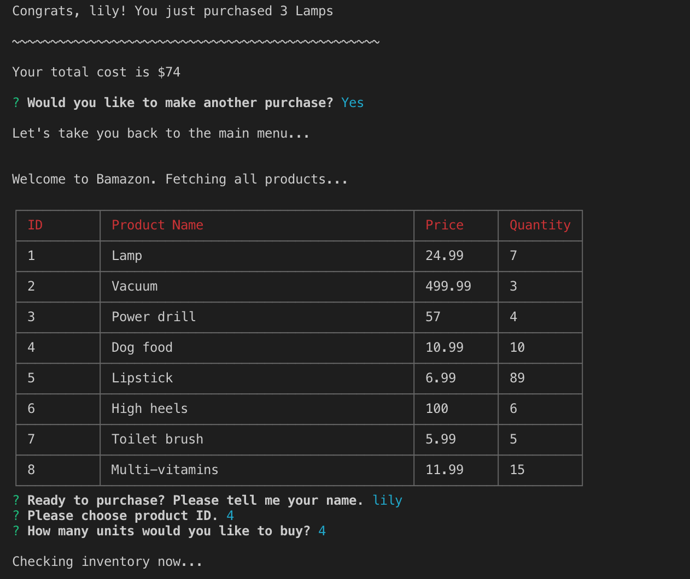
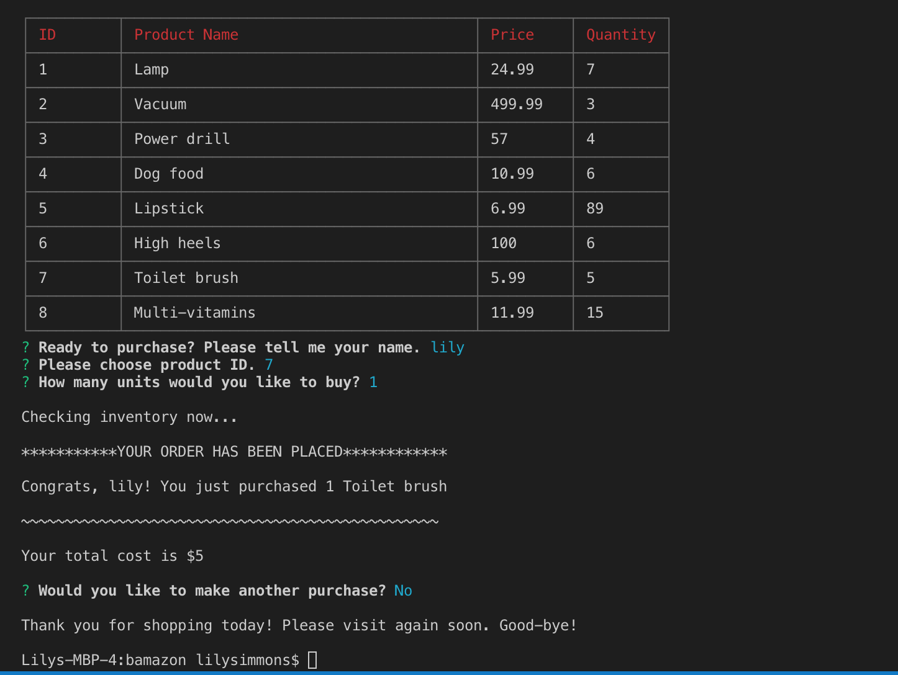

### Bamazon

Amazon-like storefront via the terminal using Node.js and the MySQL. This CLI-app will take in orders from customers and deplete stock from the store's inventory using a MySQL database.

## Prerequisites

```
required install: mysql, inquirer, MySQL database setup.  I used mySQL Workbench.  Refer to schema.sql and seeds.sql files for creating the database.
```

```
optional install: cli-table (makes the table pretty), dotenv (to hide your database info)
```

## Installing

```
npm install...
```

example:  
```
npm install mysql
```

### USER FLOW

Navigate to the repository. In the command line, start the application by typing "node bamazonCustomer.js" into the command line.  This calls a function to immediately render a table of all the products for sale.  You will then be prompted by Inquirer to enter your name and choose the ID of the product you would like to buy, and the number of units:




As you can see in the screen shot above, you cannot buy more than is stocked in the database.  If you over-draw the database you will get a message for `Insufficient quantity!`.


If there is sufficient quanity, your purchase will be fulfilled and your total cost will display:




Your purchase will automatically deduct from the database.  Notice that we started with 10 lamps, and after a purchase of 3, the stock is now 7 lamps:




If you choose to make another purchase, the app will start over.  If you choose not to make another purchase, it terminates the connection:




### User Flow

Challenge #1: Customer View (Minimum Requirement)


Create a MySQL Database called bamazon.
Then create a Table inside of that database called products.
The products table should have each of the following columns:

item_id (unique id for each product)
product_name (Name of product)
department_name
price (cost to customer)
stock_quantity (how much of the product is available in stores)


Populate this database with around 10 different products. (i.e. Insert "mock" data rows into this database and table).
Then create a Node application called bamazonCustomer.js. Running this application will first display all of the items available for sale. Include the ids, names, and prices of products for sale.
The app should then prompt users with two messages.


The first should ask them the ID of the product they would like to buy.
The second message should ask how many units of the product they would like to buy.


Once the customer has placed the order, your application should check if your store has enough of the product to meet the customer's request.


If not, the app should log a phrase like Insufficient quantity!, and then prevent the order from going through.


However, if your store does have enough of the product, you should fulfill the customer's order.


This means updating the SQL database to reflect the remaining quantity.
Once the update goes through, show the customer the total cost of their purchase.
